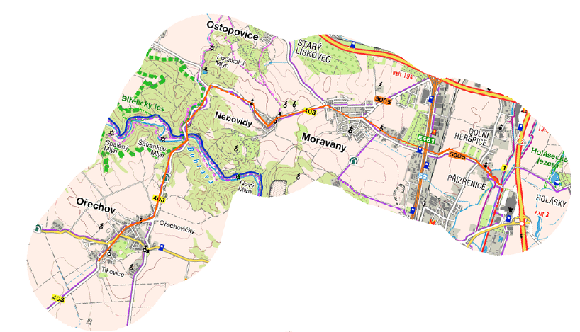

PathMap
=======

Tool for creating pdfs with map pieces covering given path.

Use case
--------

Suppose you would like to go on a cycling trip across Czech Republic, you have
a path planned and intend to use paper maps. It would be impractical to buy
conventional cycling maps for this purpose, as you would need to get many of
them, pay a lot and carry unnecessary weight while using only a thin strip of
each map.

This tool enables you to print only the parts of the map you would need. It
takes gpx file with your path as an input (this can be created for example at
http://cykloserver.cz/cykloatlas) and creates a pdf file with map pieces
covering your path and its surroundings to some distance you can specify in
pixels. The pieces cut from your path are small enough not to
overflow the page and sometimes rotated to save vertical space.

Here is an example of how it can look like:



Let your path be stored in file `path.gpx`. Then running
```
$ python3 main.py path.gpx -o path.pdf
```
will result in map pdf named `path.pdf`.

Command line options
--------------------

* `-r, --radius`: Radius of the covered map area around the path in pixels.
  Default 130 px.
* `-c, --color`: Color of the path in map image. Default `red`.
* `-o, --output`: Name of the output pdf file. Default `<path.gpx>.pdf`.

Dependencies
------------
* PIL
* requests
* lxml
* latex
* shapely
* pyproj

TODO
----

* add more tests
* add more map providers, e. g. Google maps
